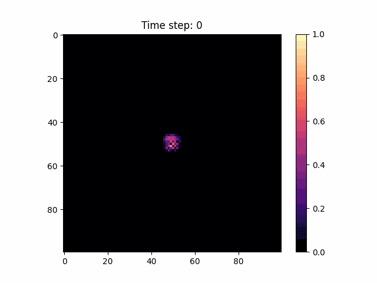

#  Tumor Growth Simulation using Reaction-Diffusion Modeling

This repository contains a mathematical model simulating tumor growth using 2D reaction-diffusion equations with logistic growth and biological noise. The project was developed as part of a course on **Mathematical Modeling**, where the goal was to build a simplified, biologically inspired simulation.

---

##  Objective

To model and visualize how a tumor evolves in space and time by integrating:
- Local proliferation of tumor cells (via logistic growth)
- Spatial diffusion (to mimic cell migration)
- Biological variability (noise in growth rates)
- Clonal mutation (region of faster growth)
- Growth suppression in overcrowded regions (necrosis)

---

##  Mathematical Formulation

The tumor cell density $$\( u(x, y, t) \)$$ is governed by a spatially extended reaction-diffusion equation:

$$
\frac{\partial u(x, y, t)}{\partial t} = D(x, y) \nabla^2 u + r(x, y) \cdot u \left(1 - \frac{u}{K} \right)
$$

Where:

- \( u(x, y, t) \): Tumor cell density at location \( (x, y) \) and time \( t \)
- \( D(x, y) \): Spatially varying diffusion coefficient (simulates heterogeneous tissue)
- \( r(x, y) \): Noisy growth rate, with mutation region having amplified growth
- \( K \): Carrying capacity of the environment
- Logistic term \( u(1 - u/K) \): Controls population growth dynamics
- Laplacian \( \nabla^2 u \): Models local diffusion of cells

---

##  Biological Interpretations

| Mechanism       | Implemented As        | Interpretation |
|----------------|------------------------|----------------|
| Tumor Seeding  | Noisy bump at center   | Initial tumor cells |
| Cell Migration | Spatial diffusion \( D(x,y) \) | Movement through tissue |
| Cell Division  | Logistic growth        | Crowded cells divide slower |
| Mutation       | Boosted \( r \) in top-right quadrant | A subclone grows faster |
| Necrosis       | Suppressed growth where \( u > 0.9K \) | Overcrowded cells stop dividing |
| Tissue Heterogeneity | Randomized \( D(x,y) \) map | Uneven environment |

---

##  Simulation Output

The model is solved numerically in a discretized 2D grid over time. Below is an animation of tumor growth:

---

##  Repository Contents

- `tumorgrowth.ipynb`: Main simulation notebook (includes all math, modeling, and visualizations)
- `2dtumor_growthnoisy2.gif`: Output animation 
- `README.md`: Documentation for understanding and reproducing the model

---

##  libraries 

- Python (NumPy, Matplotlib)
- PDE-based simulation (finite differences)
- Basic animation rendering

